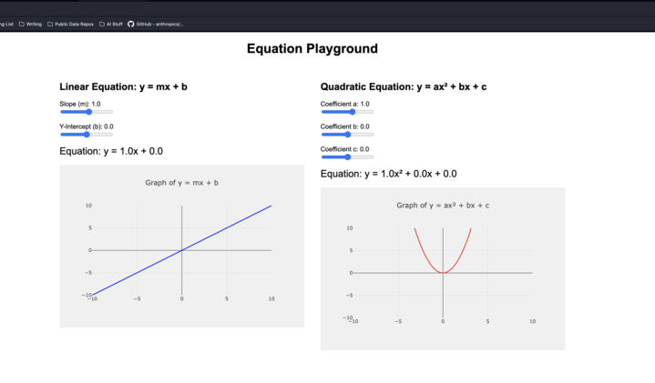

# Equation-Playground
Interactive tool for understanding Algebraic Equations I made for my daughter to help visualize how changes in equations affect the graph.

## How to use
1. Clone the repository
2. Run `pip install -r requirements.txt`
3. Run `python app.py`
4. Open your browser and navigate to `http://localhost:5050`
5. Play around with the sliders to see how changes in the equation affect the graph.

